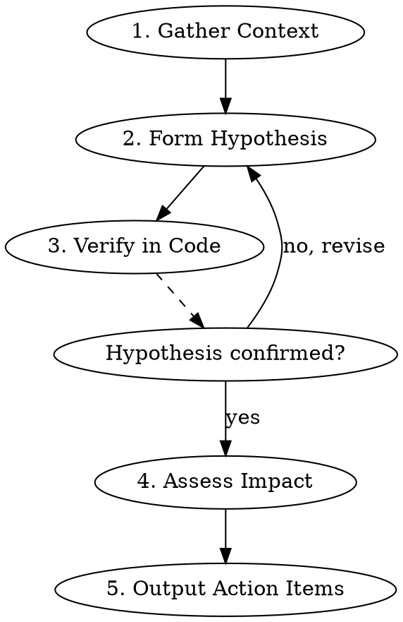

# Analyze Asana Issue Ticket

Systematic methodology for investigating Asana issue tickets to identify root cause and produce actionable items. Prevents common gaps: vague conclusions, missing code verification, unclear next steps.

## When to Use

- Assigned a new issue ticket from Support queue
- Need to understand root cause before fixing
- Preparing investigation summary for handoff

## Investigation Workflow



### Phase 1: Gather Context

**From Asana ticket:**
- [ ] Read issue description - extract exact symptoms
- [ ] Read ALL comments - find investigation progress
- [ ] Check custom fields (Priority, Product, Feature, Org ID)
- [ ] Note timeline: created_at, when symptoms started, last working date

**From related sources:**
- [ ] Search similar tickets (same Feature, same symptoms)
- [ ] Check if regression (did it work before? when did it break?)

### Phase 2: Form Hypothesis

Write ONE testable hypothesis:

```
IF [condition] THEN [expected behavior]
BUT [actual behavior observed]
THEREFORE [suspected root cause]
```

Example:
```
IF user consents but doesn't add friend
THEN tags should still be recorded (per previous behavior)
BUT tags are not recorded
THEREFORE tag recording logic was changed to require follow status
```

### Phase 3: Verify in Code

**MUST explore codebase to verify hypothesis:**

1. Identify relevant code paths (use Grep/Glob)
2. Find the exact logic that controls the behavior
3. Check git history if suspecting regression (`git log -p --since="2025-01-01" -- path/to/file`)
4. Document findings with file:line references

**Red flag:** If you conclude without reading code, you're guessing.

### Phase 4: Assess Impact

| Dimension | Question |
|-----------|----------|
| Scope | How many customers affected? (one org vs all orgs) |
| Severity | Data loss? Revenue impact? Workaround exists? |
| Urgency | SLA deadline? Customer escalation? |
| Blast radius | If we fix it, what else might break? |

### Phase 5: Output Action Items

**Required format:**

```markdown
## Root Cause
[One sentence explaining WHY this happens, with code reference]

## Evidence
- [file:line] - [what it shows]
- [query/log] - [what it shows]

## Action Items
- [ ] [Specific action] - [Owner] - [Why needed]
- [ ] [Specific action] - [Owner] - [Why needed]

## Decision Needed (if applicable)
- [ ] Is this a bug or intended behavior change?
- [ ] Should we fix or document as expected?
```

## Anti-Patterns

| Bad | Good |
|-----|------|
| "Looks like a backend issue" | "Tag is added in `line/models.py:423` only when `is_followed=True`" |
| "Need to investigate more" | "Next step: query `pbec_event` table for org 5338 to verify events exist" |
| "This might be a regression" | "Git blame shows this logic changed in commit abc123 on 2025-06-15" |

## Quick Checklist

Before marking investigation complete:

- [ ] Hypothesis formed and tested
- [ ] Code explored (not just comments read)
- [ ] Root cause identified with file:line reference
- [ ] Impact assessed (scope, severity, urgency)
- [ ] Action items are specific and assigned
