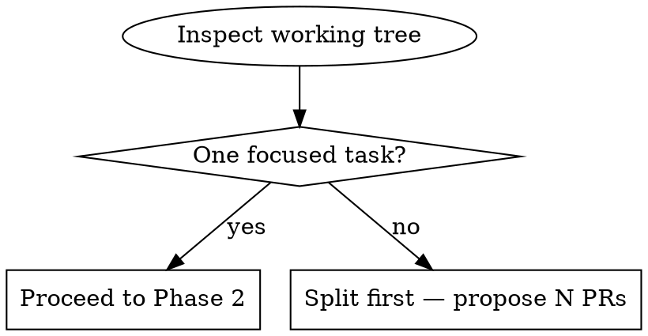

# Create PR

Delivers completed work as a focused, reviewable PR following FoD (Feature on Demand) principles. Always starts from `develop`, enforces scope discipline before branching, and uses conventional commits.

## Phase 1: FoD Scope Check (Gate — Must Pass Before Branching)

Assess what's in the working tree **first**. Do not create a branch until scope is confirmed.

```bash
git status
git diff --stat HEAD
```

Ask: does this changeset contain **exactly one primary task**?



**FoD splitting rules:**

| Situation | Action |
|-----------|--------|
| Pure refactor mixed with feature | Separate PRs |
| Schema/model change + feature code | Separate PRs (schema first) |
| Multiple new UI surfaces | One PR per surface |
| Feature flag + code that uses it | Same PR is OK |
| Import updates after a refactor | Same PR as the refactor |

If splitting is needed, **stop and tell the user**:
> "This changeset has [X] independent concerns. Recommend splitting into [N] PRs: PR1 (…), PR2 (…). Which should we start with?"

## Phase 2: Branch Setup

Always start from `develop`:

```bash
git fetch origin
git checkout develop
git pull origin develop
git checkout -b <type>/<short-description>
```

**Branch naming:**

| Type | Pattern | Example |
|------|---------|---------|
| New feature | `feat/<topic>` | `feat/user-export-csv` |
| Bug fix | `fix/<topic>` | `fix/login-redirect-loop` |
| Refactor | `refactor/<topic>` | `refactor/extract-auth-middleware` |
| Chore/tooling | `chore/<topic>` | `chore/upgrade-eslint` |

Use lowercase, hyphens only, ≤ 40 chars.

## Phase 3: Commit

Stage specific files and commit with conventional format. **Commit messages must be in English.**

```bash
git add <specific-files>   # Never git add -A blindly
git commit -m "<type>(<scope>): <short summary>"
```

**Commit types:** `feat`, `fix`, `refactor`, `test`, `chore`, `docs`

One logical change per commit. If the summary needs "and", consider splitting.

## Phase 4: Create PR

```bash
git push -u origin <branch-name>

gh pr create \
  --title "<type>(<scope>): <short description>" \
  --base develop \
  --body "$(cat <<'EOF'
## What

[One sentence: what this PR does]

## Why

[Why this change is needed — link to ticket/issue if applicable]

## How to Test

- [ ] [Step 1]
- [ ] [Step 2]

## Notes

[Trade-offs, follow-up PRs, caveats — omit if none]
EOF
)"
```

**PR title:** < 70 chars, English, same `type(scope): description` format as commit.

**Required sections:** What + Why + How to Test. Notes is optional.

## Phase 5: Stacked PRs (When There Are Dependencies)

When one PR depends on another, stack them:

```bash
# PR1: base change targeting develop
git checkout -b feat/base-schema develop
gh pr create --base develop --title "feat: add schema"

# PR2: depends on PR1 — target PR1's branch as base
git checkout -b feat/feature-using-schema feat/base-schema
gh pr create --base feat/base-schema --title "feat: implement feature"
```

Announce the stack to the user before creating:
> "I'll create 2 stacked PRs: PR1 (schema, base=develop) → PR2 (feature, base=PR1's branch)."

## Common Mistakes

| Mistake | Correct Approach |
|---------|----------------|
| Branch from current feature branch | Always checkout `develop` first |
| `git add -A` without reviewing | Stage specific files; check for secrets and generated files |
| Mixed scope in one PR | FoD check in Phase 1 is a hard gate |
| PR title > 70 chars | Move detail to body |
| Missing `--base develop` | Always specify; default may be wrong |
| Auto-commit without asking | Summarize changes, wait for user to say "commit" or "PR" |
