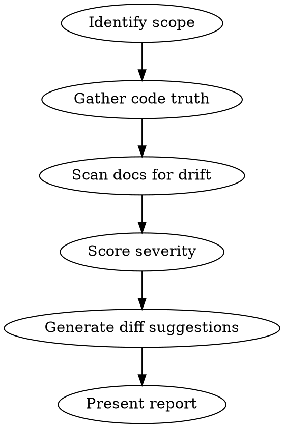

# Living Documentation

Detect drift between code and documentation, then produce actionable fix suggestions.

## Overview

Code changes constantly. Docs don't keep up. This skill systematically detects documentation drift and produces **ready-to-apply diff suggestions** — not just descriptions of problems.

**Core principle:** Every code change has a documentation blast radius. Trace it, measure the drift, fix it.

## Two Modes

### Manual: `/living-docs` or "check if docs are up to date"

Run a full or scoped audit. Use when asked explicitly.

### Hook-triggered: Post-commit drift detection

Detect drift introduced by recent commits. Scope analysis to only files affected by the change.

## The Process



### Step 1: Identify Scope

**Manual mode:** Determine which area the user wants audited. Default to full project if unspecified.

**Incremental mode (post-commit):** Use `git diff HEAD~1` (or the relevant commit range) to identify changed files. Map each changed file to its documentation blast radius:

| Changed file type | Documentation blast radius |
|---|---|
| Route/endpoint definition | API docs, OpenAPI spec, README API section |
| Schema/model/migration | API docs (request/response shapes), data model docs |
| package.json / config | README (install steps, prerequisites, env vars) |
| Function signature | JSDoc/docstring on that function, any docs referencing it |
| Dockerfile / CI config | Deployment guide, contributing guide |
| New dependency added | README prerequisites, deployment guide |

### Step 2: Gather Code Truth

For each area in scope, extract the **source-of-truth** from code:

- **API endpoints:** Read route files + controller/handler code. Extract: HTTP method, path, request schema (Zod/Pydantic/JSON Schema), response shape, auth requirements.
- **Project setup:** Read package.json/pyproject.toml/go.mod. Extract: package manager, scripts, dependencies, required env vars (trace imports of env/config modules).
- **Function signatures:** Read function definitions. Extract: parameter names/types, return type, side effects, exceptions.

### Step 3: Scan Docs for Drift

Compare code truth against each documentation file in scope. Check **every** item below — do not skip any:

**API docs checklist:**
- [ ] HTTP method matches (GET/POST/PUT/PATCH/DELETE)
- [ ] URL path matches
- [ ] All request fields documented (name, type, required, default)
- [ ] All response fields documented (including nested objects)
- [ ] Status values / enums are complete
- [ ] Pagination model matches (offset vs cursor, default limit)
- [ ] Auth requirements documented
- [ ] All endpoints that exist in code are present in docs
- [ ] Error responses documented

**README / project docs checklist:**
- [ ] Package manager matches
- [ ] Install commands work with declared package manager
- [ ] All required env vars listed
- [ ] All infrastructure prerequisites listed (databases, caches, queues)
- [ ] Architecture description matches actual directory structure
- [ ] Available scripts/commands listed
- [ ] Version requirements accurate — check transitive constraints (e.g., pnpm 9 requires Node 18+, not just what README claims)
- [ ] All `scripts` in package.json/Makefile documented (especially setup-critical ones like db:migrate, seed)

**Code-level docs checklist:**
- [ ] Function/method parameters match signature
- [ ] Return type matches
- [ ] Side effects documented (DB writes, queue jobs, external API calls)
- [ ] Exceptions/errors documented
- [ ] Deprecated markers present where needed

### Step 4: Score Severity

| Severity | Criteria | Examples |
|---|---|---|
| **CRITICAL** | Following the docs causes immediate failure or wrong behavior | Wrong HTTP method, missing required env var, wrong package manager, wrong pagination model |
| **WARNING** | Missing information that leads to incomplete understanding | Undocumented fields, undocumented endpoints, incomplete enum values, stale architecture description |
| **INFO** | Minor or cosmetic drift that won't cause failures | Soft delete vs hard delete nuance, response includes extra undocumented fields |

### Step 5: Generate Diff Suggestions

**This is the key step.** For each discrepancy, produce a concrete before/after — not just a description.

Format each suggestion as:

````markdown
### [SEVERITY] Brief description

**File:** `path/to/doc.md` (lines X-Y)
**Cause:** `path/to/code.ts` (lines A-B)

**Current doc:**
```
[exact current text from the doc]
```

**Suggested fix:**
```
[exact replacement text]
```
````

Rules for generating suggestions:
- Match the existing doc's style, tone, and formatting conventions
- Only change what needs changing — preserve surrounding context
- For API docs: derive field descriptions from schema definitions, code comments, and variable names
- For README: keep it concise — match the existing level of detail
- For JSDoc: follow the existing JSDoc/docstring style in the project

### Step 6: Present Report

```markdown
## Documentation Drift Report

**Scope:** [what was analyzed]
**Code reference:** [commit range or files]
**Found:** X critical, Y warnings, Z info

### Critical

[diff suggestions sorted by impact]

### Warning

[diff suggestions]

### Info

[diff suggestions]
```

## When NOT to Use

- Generating docs from scratch for undocumented code (use `docs:update-docs` instead)
- Reviewing code quality (use code review skills)
- The project has no existing documentation

## Common Mistakes

| Mistake | Fix |
|---|---|
| Describing drift without producing diffs | Every finding MUST have a before/after suggestion |
| Full project scan when only one file changed | Use incremental mode — scope to the blast radius of the change |
| Missing a doc type entirely | Follow ALL three checklists — API, README, code-level |
| Inventing information not in the code | Only document what you can verify from source code |
| Changing doc style/formatting beyond the fix | Match existing conventions — minimal diff |
| Checking version at face value | Trace transitive constraints — tool X requires runtime Y version Z |
| Producing a report without the summary table | Always end with a severity count summary table |
