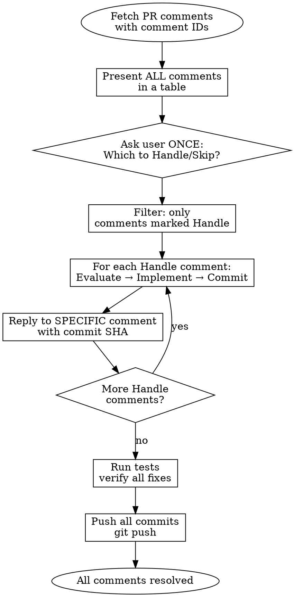

# PR Comment Resolution

## Overview

Resolving PR comments requires **action, not description**. Every comment must be: evaluated → implemented (or discussed) → replied to → tracked.

## Resolution Flow



**Key principle:** Batch confirm ALL comments first, then process each "Handle" comment with separate commits and specific replies.

## Step 1: Fetch All Comments with IDs

```bash
# Get PR number and repo info
gh pr view --json number,url

# Get all review comments with their IDs (needed for replies)
gh api repos/{owner}/{repo}/pulls/{pr_number}/comments \
  --jq '.[] | {id, path, line, body, user: .user.login}'
```

**Create tracking list with comment IDs:**

```markdown
## PR Comments to Resolve

| ID | File | Line | Reviewer | Comment | Status |
|----|------|------|----------|---------|--------|
| 12345 | auth/views.py | 45 | @senior-dev | Add email validation | pending |
| 12346 | auth/views.py | 52 | @senior-dev | Use get_object_or_404 | pending |
| 12347 | auth/services.py | 23 | @security-lead | Token expiry 15min | pending |
```

## Step 2: Batch Confirmation (Ask Once for All)

**Present ALL comments in a table and ask user to decide which to handle:**

```
## PR Review Comments

| # | ID | File | Reviewer | Comment | Action? |
|---|-----|------|----------|---------|---------|
| 1 | 12345 | auth/views.py:45 | @senior-dev | Add email validation | ? |
| 2 | 12346 | auth/views.py:52 | @senior-dev | Use get_object_or_404 | ? |
| 3 | 12347 | auth/services.py:23 | @security-lead | Token expiry 15min | ? |
| 4 | 12348 | auth/tests.py:78 | @junior-dev | Add expired token test | ? |

Which comments should I handle? (e.g., "1,3,4" or "all" or "1-3")
```

**Use AskUserQuestion tool ONCE to get user's selection. Do NOT process without confirmation.**

After user responds (e.g., "1,3,4"):
- Mark selected as "Handle"
- Mark others as "Skip"
- Process only "Handle" comments

## Step 3: Evaluate (After User Confirms "Handle")

**Before implementing, assess the suggestion:**

| Question | If No |
|----------|-------|
| Is it technically correct? | Reply explaining the issue |
| Does it fit the codebase patterns? | Suggest alternative approach |
| Is it a security/bug fix? | Prioritize highly |
| Is it style preference? | Can discuss or accept |

**Red flags - don't blindly implement:**

- Suggestion breaks existing tests
- Suggestion contradicts project conventions
- Suggestion introduces security risk
- Reviewer may have misunderstood context

## Step 4: Implement Fix

**MUST use Edit tool to make actual changes. Do NOT just describe.**

```python
# ❌ BAD: Describing what to do
"You should add validation like this..."

# ✅ GOOD: Actually making the change
[Edit tool: auth/views.py - add validation code]
```

## Step 5: Commit and Reply with SHA Link

**After each fix, commit immediately and reply to the SPECIFIC comment with a linked commit SHA:**

```bash
# 1. Stage the changed file(s)
git add auth/views.py

# 2. Commit with reference to comment ID
git commit -m "fix(auth): add email validation before DB query

Addresses review comment #12345 by @senior-dev"

# 3. Get commit SHA and repo info
COMMIT_SHA=$(git rev-parse --short HEAD)
FULL_SHA=$(git rev-parse HEAD)
REPO_URL=$(gh repo view --json url -q .url)

# 4. Reply with clickable commit link
gh api repos/{owner}/{repo}/pulls/{pr_number}/comments/{comment_id}/replies \
  -f body="Fixed in commit [\`${COMMIT_SHA}\`](${REPO_URL}/commit/${FULL_SHA}).

Added email validation using Django's validate_email before the database query."
```

**Reply format template:**
```
Fixed in commit [`abc1234`](https://github.com/owner/repo/commit/abc1234def5678...).

[Brief description of what was changed]
```

The SHA becomes a clickable link to the commit diff on GitHub.

## Step 6: Process Next Handle Comment

**After completing one comment, move to the next "Handle" comment (no need to ask again).**

Update tracking table as you go:

| # | ID | File | Reviewer | Action | Status | Commit |
|---|-----|------|----------|--------|--------|--------|
| 1 | 12345 | auth/views.py:45 | @senior-dev | Handle | ✅ done | `abc1234` |
| 2 | 12346 | auth/views.py:52 | @senior-dev | Skip | ⏭️ skipped | - |
| 3 | 12347 | auth/services.py:23 | @security-lead | Handle | 🔄 in progress | - |
| 4 | 12348 | auth/tests.py:78 | @junior-dev | Handle | pending | - |

**Repeat Steps 3-5 for each "Handle" comment until all are done.**

## Step 7: Final Verification and Push

**After all "Handle" comments are processed:**

```bash
# Run relevant tests
pytest auth/tests/ -v

# Push all commits at once
git push
```

## Quick Reference

| Action | Command |
|--------|---------|
| Get PR info | `gh pr view --json number,url` |
| Get repo URL | `gh repo view --json url -q .url` |
| List comments with IDs | `gh api repos/{owner}/{repo}/pulls/{pr}/comments` |
| Reply to SPECIFIC comment | `gh api .../comments/{id}/replies -f body="..."` |
| Get short SHA | `git rev-parse --short HEAD` |
| Get full SHA | `git rev-parse HEAD` |
| Commit link format | `[short](repo_url/commit/full_sha)` |

## Edge Cases

| Situation | Action |
|-----------|--------|
| **Conflicting suggestions** | Tag both reviewers, ask for consensus before implementing |
| **Already resolved threads** | Skip - only address unresolved comments |
| **Outdated comments** | Check if code has changed; reply if already fixed |
| **Vague comments** | Ask for clarification before implementing |

## Common Mistakes

| Mistake | Correct Approach |
|---------|------------------|
| Process without asking | Show ALL comments first, ask user which to Handle/Skip |
| Ask for each comment separately | Ask ONCE for all comments (batch confirmation) |
| Batch all fixes in one commit | Commit EACH fix separately with comment reference |
| Reply to general PR, not specific comment | Use `gh api .../comments/{id}/replies` for specific reply |
| Only describe fixes, don't implement | Use Edit tool to make actual changes |
| Blindly accept all suggestions | Evaluate each suggestion; push back if incorrect |

## Commit Message Template (Per Comment)

```bash
git commit -m "fix(auth): add email validation before DB query

Addresses review comment #12345 by @senior-dev"
```

**Key points:**
- One commit per comment (not batch)
- Include comment ID in commit message
- Mention reviewer username
