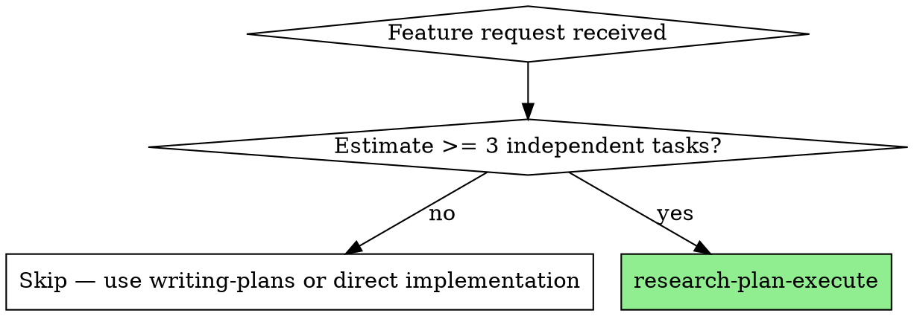
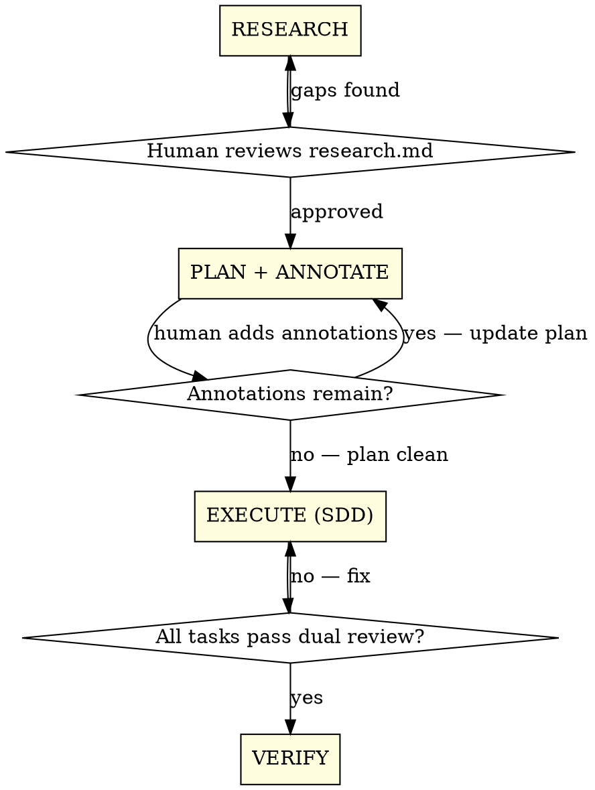

# Research-Plan-Execute

Structured feature development: research the codebase, build an annotated plan with human review, then execute via subagents with dual review gates.

**Core principle:** No code before approved plan. No approved plan before structured research. No task completion without spec + quality review.

## When to Use



**Use when:** Multi-file feature work, cross-module changes, unfamiliar codebase areas, tasks requiring architectural decisions.

**Don't use for:** Single-file fixes, well-understood patterns, tasks < 3 independent units.

## The Four Phases



## Phase 1: RESEARCH

Deep-read the relevant codebase. Produce `research.md` with this structure:

```markdown
# Research: [Feature Name]

## Architecture Overview
- Relevant modules, their relationships, data flow
- Entry points and boundaries

## Key Patterns
- Existing conventions to follow (naming, file structure, state management)
- Reusable components/hooks/utilities already available

## Constraints & Risks
- Technical limitations, compatibility concerns
- Potential breaking changes, migration needs

## Dependencies
- External services, APIs, package versions
- Cross-repo or cross-team impacts

## Open Questions
- Items requiring human decision (list explicitly)
```

**Present `research.md` to the human for review before proceeding.**

Research is NOT a quick scan. It is a structured document the human can verify.

## Phase 2: PLAN + ANNOTATE

Produce `plan.md` with SDD-compatible task list. Then enter the **Annotation Cycle**.

### Plan Format

Each task must be independently implementable by a subagent:

```markdown
# Plan: [Feature Name]

## Task 1: [Title]
- **Files:** list of files to create/modify
- **Approach:** specific implementation strategy
- **Depends on:** other task numbers, or "none"
- **Acceptance criteria:** what "done" looks like

## Task 2: [Title]
...
```

### Annotation Cycle

The human adds inline annotations using three markers:

```markdown
<!-- REJECT: reason to remove or replace this -->
<!-- CORRECT: factual or technical correction -->
<!-- ADD: missing requirement or consideration -->
```

Free-form notes are also accepted. The cycle:

1. Human adds annotations to `plan.md`
2. Claude updates plan, addresses all annotations, removes processed markers
3. Repeat until plan has zero annotations
4. Human gives explicit approval: "Plan approved"

**Minimum: 1 annotation round. Do NOT skip this even if the plan "looks good."**

Ask the human: "Please review the plan and add annotations. Use `REJECT:`, `CORRECT:`, or `ADD:` markers, or write free-form notes."

## Phase 3: EXECUTE

**REQUIRED:** Use `superpowers:subagent-driven-development` for execution.

The controller:
1. Reads `plan.md` + `research.md`
2. Extracts all tasks into TodoWrite
3. Per task: dispatches fresh implementer subagent with task text + relevant research context
4. Per task: spec compliance review, then code quality review
5. Review loops until both pass

**Controller provides research context to each subagent.** Extract only the sections of `research.md` relevant to that task — do not dump the entire file.

## Phase 4: VERIFY

**REQUIRED:** Use `superpowers:verification-before-completion` before claiming done.

Then use `superpowers:finishing-a-development-branch` for merge/PR decisions.

## Rationalization Table

These thoughts mean STOP — you are about to violate the workflow:

| Thought | Reality |
|---------|---------|
| "Scope is small enough to hold in my head" | If >= 3 tasks, you need a written plan. Memory is unreliable. |
| "Writing a plan is procrastination" | A plan reviewed by a human catches wrong assumptions. Code without a plan is rework. |
| "I'll course-correct as I go" | Mid-implementation corrections cost 10x more than plan annotations. |
| "User said 'don't stop' — stopping = disrespect" | Quality gates are not interruptions. Spec + quality review happen automatically, without human blocking. |
| "Self-review is sufficient" | Self-review catches typos. Independent spec review catches missed requirements. Both are needed. |
| "Time is tight, skip research" | Research prevents building on wrong assumptions. 15 min research saves hours of rework. |
| "Tests last is fine, I'll keep testability in mind" | Subagents follow TDD. Tests-first is non-negotiable in execution phase. |
| "No objections in 5 minutes = plan approved" | Silence is not approval. Wait for explicit "Plan approved" from the human. |

## Red Flags — STOP and Reassess

- Writing code before `research.md` is approved
- Writing code before `plan.md` has zero annotations
- Skipping annotation cycle because "plan looks good"
- Implementing multiple tasks without per-task review gates
- Using one long session instead of fresh subagents per task
- Treating `research.md` as "quick scan notes" instead of structured document
- Setting a timeout on annotation cycle ("if no objections in X minutes, I'll proceed")

## Common Mistakes

| Mistake | Correct Approach |
|---------|------------------|
| Dumping entire research.md to every subagent | Extract only relevant sections per task |
| Free-form plan without acceptance criteria | Each task needs explicit "done" definition |
| Annotation cycle with zero rounds | Minimum 1 round, even if plan seems perfect |
| Skipping Phase 1 for "familiar" code | Familiarity breeds blind spots. Research anyway. |
| Merging Plan + Research into one step | They are separate phases with separate human review gates |

## Integration

**Required skills:**
- `superpowers:subagent-driven-development` — Phase 3 execution engine
- `superpowers:verification-before-completion` — Phase 4

**Complementary skills:**
- `superpowers:writing-plans` — Plan format reference
- `superpowers:finishing-a-development-branch` — Post-verification completion
- `superpowers:test-driven-development` — Subagents use TDD during execution
